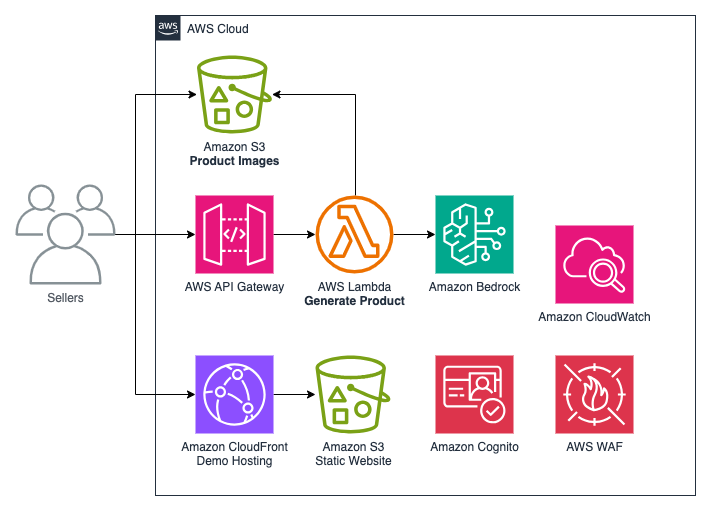

# AWS Serverless Product Data Generator

A prototype method to help sellers create product titles and descriptions using product images and optional metadata.

This README will guide you in setting up the prototype.

## Architecture


## Cost

You are responsible for the cost of the AWS services used while running this prototype. As of this revision, the cost for running this construct with the default settings in the US East (N. Virginia) Region is approximately $58.60 per month.

We recommend creating a budget through [AWS Cost Explorer](http://aws.amazon.com/aws-cost-management/aws-cost-explorer/) to help manage costs. Prices are subject to change. For full details, refer to the pricing webpage for each AWS service used in this solution.

The following table provides a sample cost breakdown for deploying this solution with the default parameters in the **US East (N. Virginia)** Region for **one month**.

| **AWS Service**                       | **Dimensions**                                                                                                                                                      | **Cost [USD]** |
|:--------------------------------------|:--------------------------------------------------------------------------------------------------------------------------------------------------------------------|----------------|
| Amazon Bedrock                        | 60 requests per hour with an average of five 1 megapixel images as context(6,000 input tokens and 200 output tokens). **Anthropic Claude 3 Haiku**                  | 75.60          |
| AWS Lambda                            | 60 requests per hour through 1 Lambda function with 512 MB of memory allocated and arm64 CPU and an average run time of 15 seconds = 43,200 requests per month      | 4.39           |
| Amazon Simple Storage Service         | 5 product images added every minute with an average size of 1 MB with expiration after 3 days = 21.6 GB per month in S3 Standard Storage and static website hosting | 1.76           |
| AWS API Gateway                       | 60 requests per hour                                                                                                                                                | 0.15           |
| Amazon CloudWatch                     | 15 metrics using 5 GB data ingested for logs                                                                                                                        | 7.02           |
| AWS X-Ray                             | 100,000 requests per month through API Gateway and Lambda calls                                                                                                     | 0.50           |
| Amazon Cognito                        | 10 demo users                                                                                                                                                       | 0.00           |
| AWS Web Application Firewall          | 43,200 requests per month using the AWS Managed Rule Group                                                                                                          | 6.03           |
| Amazon CloudFront                     | Demo UI hosting. The first 10 million requests/month and 1,024 GB/month are free                                                                                    | 0.00           |
| **Total monthly infrastructure cost** |                                                                                                                                                                     | **95.38**      |

The prototype allows you to select which model to use. The following table shows an estimated cost for each model assuming the dimensions in the above table. Anthropic Claude 3 Haiku is the default and is listed above.

| **AWS Bedrock Model**     | **Cost [USD]** |
|:--------------------------|:---------------|
| Anthropic Claude 3 Haiku  | 75.60          |
| Anthropic Claude 3 Sonnet | 907.20         |

## Initial Deployment

### Prerequisites

* Docker
* Node.js 18
* Git
* JDK: We recommend installing any Coretto version >= 11 https://docs.aws.amazon.com/corretto/
* Maven: You can any version of Maven >= 3.8: https://maven.apache.org/install.html

```shell
npm install -g @aws/pdk pnpm aws-cdk
```

#### Authentication with AWS

You must establish how the AWS CDK authenticates with AWS when deploying infrastructure. There are different ways in
which you can configure programmatic access to AWS resources, depending on the environment and the AWS access available
to you.

For an in depth guide, please refer to: https://docs.aws.amazon.com/sdkref/latest/guide/access.html

### First build

```shell
npx pnpm i
pnpm pdk build
```

### Deploy

```shell
pushd packages/infra/main
pnpm cdk bootstrap
pnpm cdk deploy GenProductDescription
```

Note the outputs from the above `cdk deploy` command.

## Activate LLMs in Amazon Bedrock
This prototype uses the Anthropic Claude 3 Haiku models and Bedrock titan Text Embeddings on Amazon Bedrock. You can enable them on https://us-east-1.console.aws.amazon.com/bedrock/home?region=us-east-1#/modelaccess

You need to enable access to the following models:
* Anthropic - Claude 3 Haiku
* Anthropic - Claude 3 Sonnet

## Demo

There is a demo web app in [packages/websites/productdescriptiondemo](packages/websites/productdescriptiondemo/README.md). It has been deployed to S3 and CloudFront and
can be accessed at the URL shown in `ProductdescriptiondemoDistributionDomainName` output from the `GenProductDescription`
CloudFormation stack.

User creation from the demo app is disabled. You can create user accounts in the Amazon Cognito console in the user pool
show in the `GenProductDescriptionUserIdentityGenProductDescriptionUserIdentityUserPoolId` CloudFormation output.

## Further Development
This prototype uses the [AWS Project Development Kit(PDK)](https://aws.github.io/aws-pdk/) as a framework on top of AWS CDK to expedite development.

### Modify project

To change the project settings such as dependencies, edit `.projenrc.ts` and run

```shell
pnpm pdk
```

### Update Code

```shell
pnpm pdk build
pushd packages/infra/main
pnpm cdk deploy GenProductDescription
popd
```

## Cleanup

Most of the services used have no cost when there is no active use with the notable exception of storage in S3,
and CloudWatch Logs.

1. In AWS CloudFormation, destroy the stacks that were deployed. Some of the S3 buckets will remain as they will not be
   empty.
2. Delete any CloudWatch Logs log groups that you do not wish to keep.
4. In any S3 buckets that remain that you do not wish to keep, empty the buckets by disabling logging and configuring a
   lifecycle policy that expires objects after one day. Wait a day.
5. After a day, go back and delete the buckets.

## Security

See [CONTRIBUTING](CONTRIBUTING.md#security-issue-notifications) for more information.

## License

This library is licensed under the MIT-0 License. See the LICENSE file.

## Troubleshooting

### Errors getting docker images from `public.ecr.aws`

Docker Desktop may get into a state where it thinks it needs to authenticate with `public.ecr.aws`.

You may need to login to docker for `public.ecr.aws`.

```shell
aws ecr-public get-login-password --region us-east-1 | docker login --username AWS --password-stdin public.ecr.aws
```
